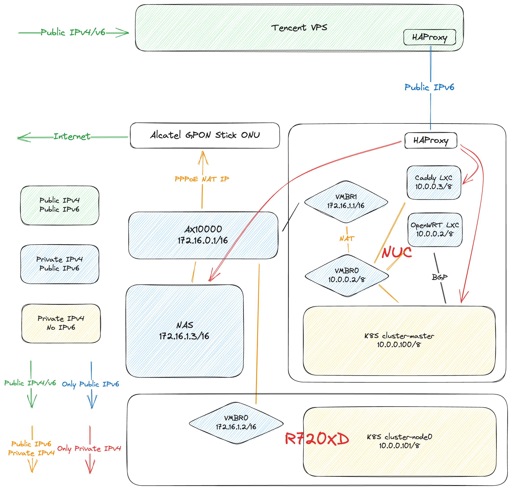

# 家庭服务器环境搭建

:::tip

没写完，慢慢更

:::

## TL;DR

架构图

<!-- truncate -->

## 硬件

列举一下硬件和价格，没写价格的就是我忘了

- NUC11TNHV79L带扩展板准系统 闲鱼4699
    - 三星 PM9A1 1TB 905
    - Kingston FURY 32G * 2 1179
- QNAP453d mini 8g 附赠四块4T 3.5寸机械硬盘 闲鱼2600
    - J4125 8g内存，买过来没动过
- Akcatel 阿尔卡特猫棒 附赠转接头 闲鱼83
- R720XD 卖家自带所有组件 闲鱼1100
    - E5-2650 * 2
    - 16g * 8 内存
    - 3T * 3 机械硬盘
    - H310 mini 阵列卡
    - 2.5寸硬盘位背板 闲鱼67.44
    - H710p阵列卡 闲鱼95
    - 杂牌 1TB * 2 固态 190
- 19寸显示器 闲鱼28
- AX10000 闲鱼1460
- TP-Link TL-SH1五口2.5g交换机 闲鱼349
- 七彩虹P106-100 拼多多89
    - 显卡电源线 拼多多6.8
- 网线耗材，没用完，反正不值几个钱，不写了

网线还有耗材啥的就不算了。

哦对了，还有强电部分

- 12v 10a 一带多电源 拼多多28.5
- 15A 面板 楼下五金店10
- 正泰NBX空开断路器 拼多多18.09
- 地线排 拼多多2.39
- 2.5平方电线 自带不要钱

