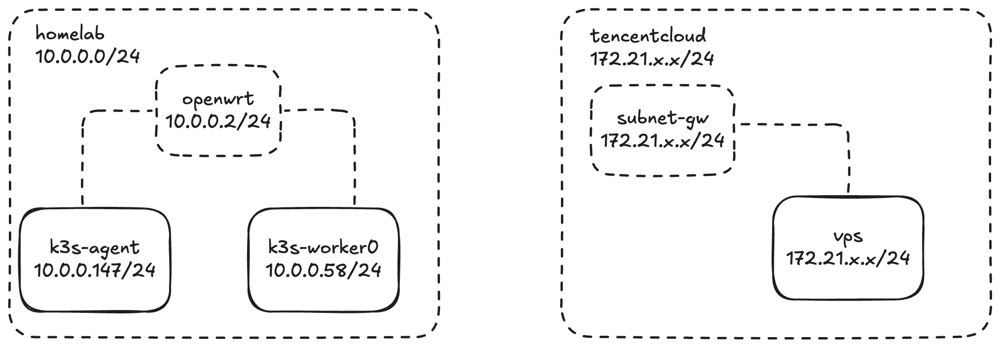
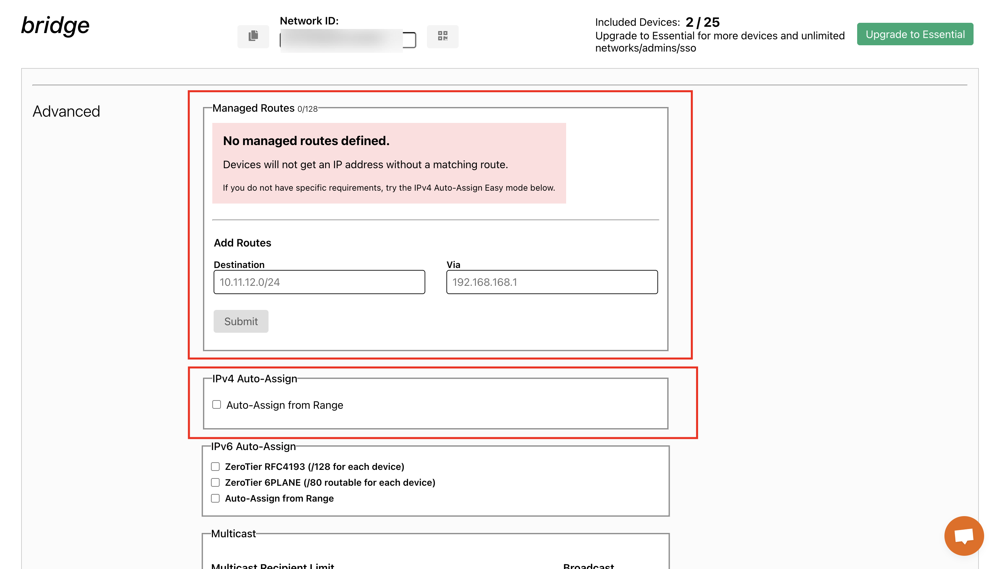
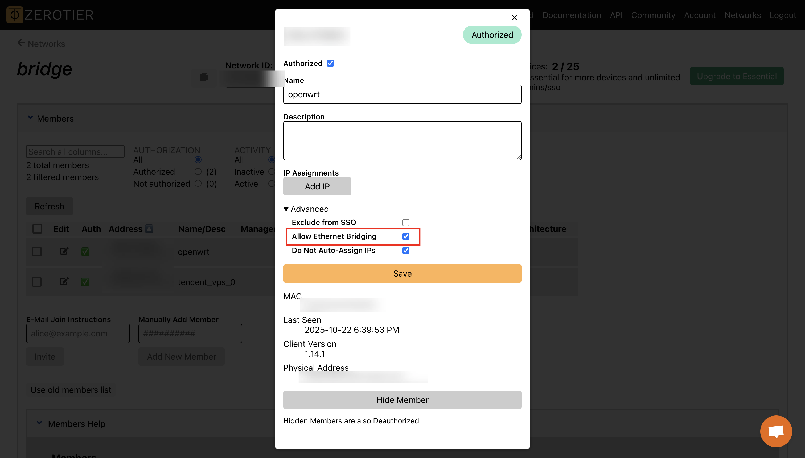
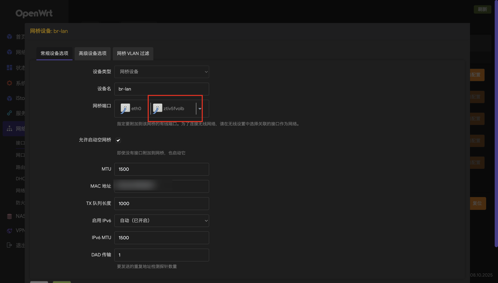
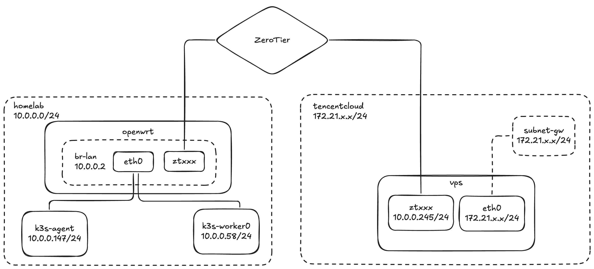

# 跨云的K8S集群搭建

好久没写文章了，来水点东西。

故事的起因是因为，老集群的kadalu炸了，glusterfs的数据没发auto heal，导致磁盘爆炸。所以决定rm -rf并新建一个集群。

在搭建集群的时候，有一个需求：在腾讯云cos上打包大量的小文件到tar.gz并存回cos上。

这就涉及到大量的网络读写，如果说在家里的服务器上跑，太慢了，所以设想的是，把workload跑在腾讯云的CVM上，这样cos上下载全部走腾讯云内网，省钱省时间。

<!-- truncate -->

于是想到，怎么样才能高效快速的把一个服务跑在腾讯云上呢。按照常规的思路，那就得

1. 本地开发一个打包的应用程序，构建成二进制或者打包好依赖或者打包成docker
2. ssh到腾讯云机器上，把应用拉下来
3. 在机器上nohup/docker run
4. 想办法监控结果

但是这样真的太麻烦了。☝️🤓如果说我把腾讯云机器也加入到我的k8集群里，是不是就完美了。

## 集群配置

集群的搭建，我们选择使用k3s，轻量化，易于搭建

使用cilium作为CNI，使用longhorn作为CSI，这都没啥问题。

现在家里的服务器上把k3s server和一个agent装好，在家里的服务器上先跑起来，这一步基本没啥问题，也算是有手就行，就不多写了。

最终的配置文件会全部贴在最后面。注意这里cilium我使用的是kubeProxyReplacement模式，具体的配置可以参考cilium官方的文档。

## 网络配置

我们知道，k8s需要保证节点之间的连通性。当然具体需要连通到什么程度，我还没有学的很深入，但肯定是越通越好，所以我们最好就是把节点给他整到同一个lan里，这样就绝对没有任何问题了。

这里我们其实有三台机器需要组成集群，但是他们不在一个lan里，两边也互相访问不到，那么我们就需要使用一些技巧给他打通。



要想让两边沟通上，其实vpn方案可选的其实还不少，主要有两类，一类就是L2 VPN桥接，类似于使用网桥/hub给他连上；另一类是L3的VPN方案，类似于用路由器给他做ip层的桥接和路由转发。

我们期望还是尽量底层的桥接，避免集群节点之间有什么神奇的协议不走IP。之前用的vpn基本都是tailscale，底层用的wireguard，但是wg只支持L3，要走L2得通过GRE走，还挺麻烦的。所以我们找一个能在L2的vpn，比如openvpn，或者zerotier。

经过选择，zerotier还是比较方便的，但是整个网上基本都没啥文档，官方的[文档](https://docs.zerotier.com/bridging/)也没写清楚到底要怎么做。所以我们自己探索。

### ZeroTier

先在 https://my.zerotier.com/ 建一个网络，然后把路由和ipv4分配都关了，因为我们桥接之后所有的路由和ip分配都会走dhcp，当然你走静态也不是不行。




然后在openwrt和vpn上都加入这个网络，接入之后，我们在网页上进行配置，选择`Allow Ethernet Bridging`

```bash
zerotier-cli join xxxxxxxxxxxxxxxx
```



这样zerotier就配置好了

### OpenWRT

在openvpn上，配置比较简单，就把zerotier的对应的iface加入到lan的桥接上就行，如果一切顺利的话，就不用动防火墙啥的。



### vps

vps上，我们需要配置接口走dhcp，这里我遇到了一个小小的问题：

1. OpenWRT上的lan配置了ipv6，且有SLAAC
2. 腾讯云的subnet也开启了ipv6

所以如果开了ipv6，zerotier的接口就会自动绑上v6的ip，同时会自动把路由加上，导致ipv6会从家里走一圈，不是很好，所以得想办法把vps的zerotier网卡的ipv6关了。

我这里用的是ubuntu24.04，使用的网络工具是netplan，配置如下：

```yaml
network:
  version: 2
  renderer: networkd
  ethernets:
    ztxxxxxxxx:
      dhcp4: true
      dhcp6: false
      link-local: [] 
```

理论上这样就能通了，如果不通那就是你自己的问题，你自己想办法解决吧。

### 加入集群

:::warning

这里有个巨大的坑！！！注意注意

:::

接下来就是要启动k3s agent了，这里有一个重要的问题，这个机器上有两张网卡，两张都是内网网卡，所以k3s会自动探测node的internalip，但是自动探测的时候会探测到eth0的网卡，ip啥的都是不对的！！！

如果这里你不改的话，cilium使用vxlan进行节点点流量的转发的时候，会搞错网卡，导致出现问题！

```
明白了，你的问题在于 Cilium 把 Node IP 选成了 172.21.0.6（可能是虚拟机的 NAT 网卡），而 VXLAN 隧道应该走你的内网网卡（比如 10.x.x.x 的网段）。这会导致跨节点 Pod 流量被封装到错误的网卡，甚至直接走了 eth0。

Cilium 选择 Node IP 的逻辑：

默认会选择第一个可用的非 127.0.0.1 的网卡 IP。

可以通过 --node-ip / --ipam / --auto-detect-node 明确指定。
```

所以你需要在安装的时候，指定node-ip：

```bash
curl -sfL https://get.k3s.io | K3S_URL='https://10.0.0.147:6443' K3S_TOKEN=xxxxxx INSTALL_K3S_EXEC='--node-ip 10.0.0.245' sh -
```


最终的架构图如下：



至于你怎么想办法调度，那就是你自己的事情了，加点taint啥的就完事了。

## 配置文件参考

### cilium-1.18.2-values.yaml

```
76c76
< k8sServiceHost: ""
---
> k8sServiceHost: "10.0.0.147"
81c81
< k8sServicePort: ""
---
> k8sServicePort: "6443"
287c287,288
< extraConfig: {}
---
> extraConfig:
>   ingress-default-xff-num-trusted-hops: "1"
479c480
<   enabled: false
---
>   enabled: true
854c855
< # devices: ""
---
> devices: ""
896c897
<   enabled: false
---
>   enabled: true
908c909
<   enabled: false
---
>   enabled: true
911c912
<   default: false
---
>   default: true
916c917
<   loadbalancerMode: dedicated
---
>   loadbalancerMode: shared
1001c1002
<   enabled: false
---
>   enabled: true
1005c1006
<   enableAppProtocol: false
---
>   enableAppProtocol: true
1008c1009
<   enableAlpn: false
---
>   enableAlpn: true
1152c1153
<   enabled: false
---
>   enabled: true
1500c1501
<     enabled: false
---
>     enabled: true
1725c1726
<     enabled: false
---
>     enabled: true
1897c1898
<       type: ClusterIP
---
>       type: LoadBalancer
1906c1907
<       enabled: false
---
>       enabled: true
1912c1913
<         - chart-example.local
---
>         - hubble.yoshino-s.xyz
2010c2011
<     clusterPoolIPv4PodCIDRList: ["10.0.0.0/8"]
---
>     clusterPoolIPv4PodCIDRList: ["10.42.0.0/16"]
2115c2116
< #kubeProxyReplacement: "false"
---
> kubeProxyReplacement: "true"
2259c2260
<     backend: disabled
---
>     backend: envoy
2859c2860
<   replicas: 2
---
>   replicas: 1
```